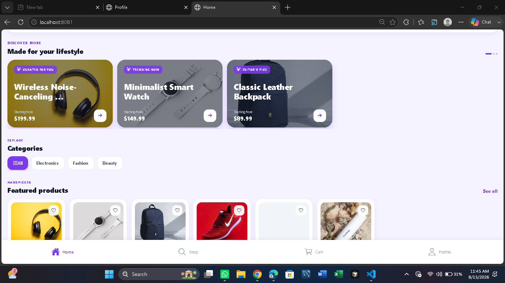
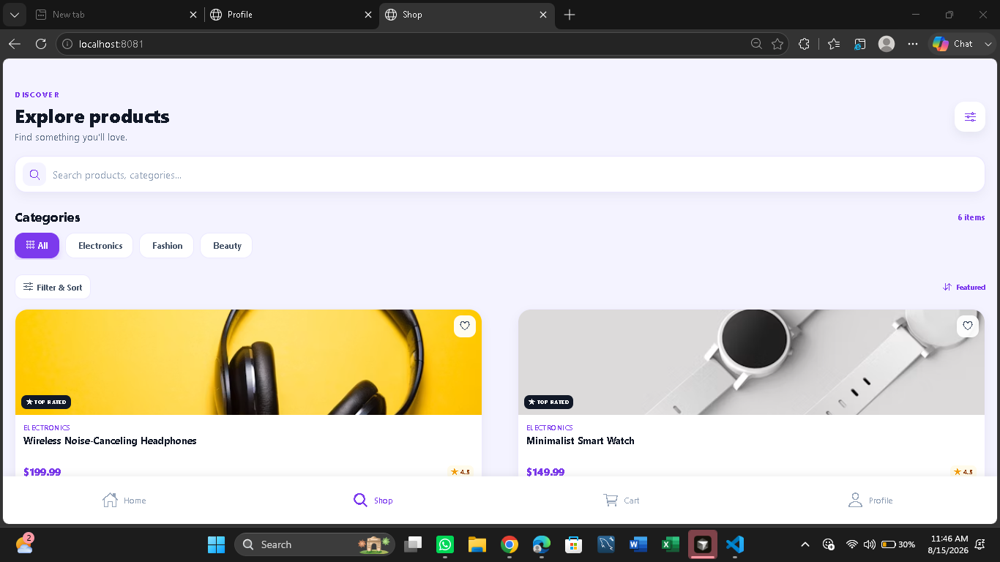
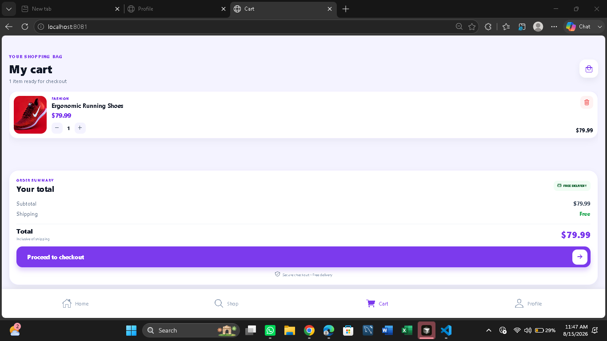
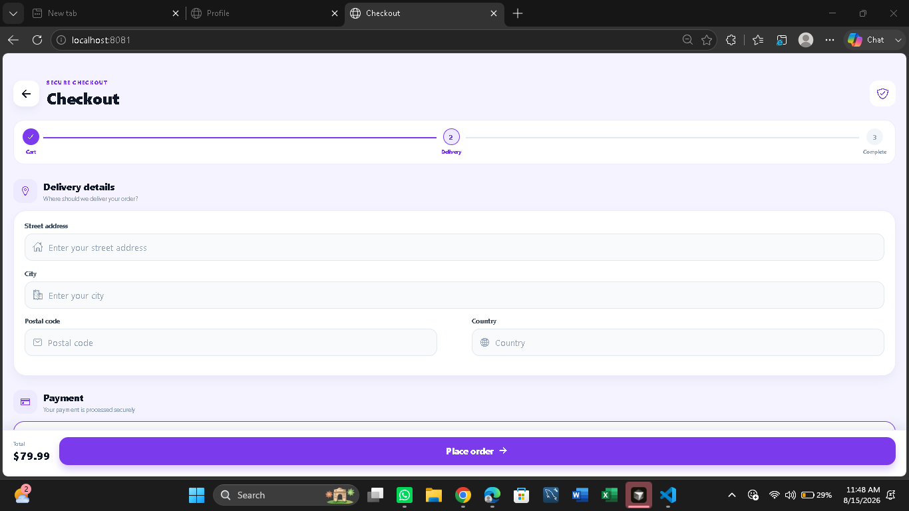
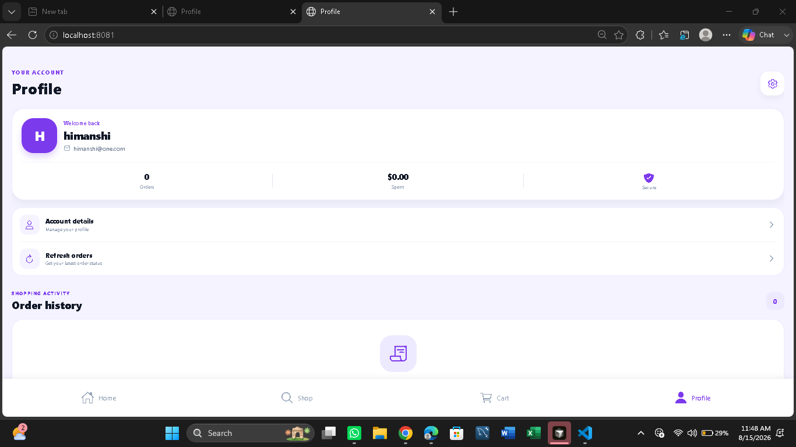

🛍️ Full-Stack E-Commerce Mobile App

  <strong>A modern, premium e-commerce mobile experience built with React Native, Expo, Node.js, Express and MongoDB.</strong>

  
  
  
  
  
  

✨ Overview

A full-stack e-commerce mobile application created for a 24-hour application development challenge.

The project focuses on a smooth shopping journey from authentication to product discovery, cart management, checkout and order history, while maintaining a clean and premium visual language.

Core flow

Splash
  ↓
Login / Signup
  ↓
Home
  ↓
Shop → Search / Filter / Sort
  ↓
Product Details
  ↓
Add to Cart
  ↓
Cart
  ↓
Checkout
  ↓
Order Placement
  ↓
Profile → Order History

🚀 Highlights

🔐 Authentication

User registration

JWT-based login

Persistent authentication with AsyncStorage

Forgot password flow

Password reset flow

Logout

Protected backend routes

🛍️ Product Discovery

Premium home screen

Hero banner

Categories

Featured products

Trending products

Special offers

Product search

Category filtering

Sorting

Responsive product grid

Product detail view

Product image gallery

Related products

🛒 Cart

Add products to cart

Increase/decrease quantity

Remove products

Automatic subtotal calculation

Free shipping summary

Checkout navigation

Backend cart persistence

📦 Checkout & Orders

Shipping address form

Order summary

Order validation

Order placement

Stock-aware order processing

Automatic cart clearing after successful order

Order history

Order status display

👤 Profile

User information

Order history

Order totals

Order status

Logout

🎨 UX & Engineering

Premium purple design system

Responsive layouts

Loading states

Empty states

Error handling

API integration through Axios

JWT token interceptor

Protected API routes

MongoDB data persistence

🧰 Tech Stack

Frontend

Technology

Purpose

React Native

Mobile UI

Expo

Development/runtime

React Navigation

Stack + bottom-tab navigation

Axios

REST API communication

AsyncStorage

Authentication persistence

NativeWind / StyleSheet

UI styling

Expo Vector Icons

Interface icons

Backend

Technology

Purpose

Node.js

Server runtime

Express.js

REST API

MongoDB

Database

Mongoose

ODM

JWT

Authentication

bcryptjs

Password hashing

CORS

Cross-origin API access

dotenv

Environment configuration

Nodemon

Development server

🏗️ Architecture

┌───────────────────────────────────────────────┐
│              React Native / Expo              │
│                                               │
│  Screens → Navigation → AuthContext → Axios  │
└──────────────────────┬────────────────────────┘
                       │ REST API
                       │ JWT Bearer Token
                       ▼
┌───────────────────────────────────────────────┐
│             Node.js + Express API             │
│                                               │
│ Routes → Middleware → Controllers → Models   │
└──────────────────────┬────────────────────────┘
                       │ Mongoose
                       ▼
┌───────────────────────────────────────────────┐
│                    MongoDB                    │
│                                               │
│ Users • Products • Carts • Orders             │
└───────────────────────────────────────────────┘

📁 Project Structure

ecommerce-fullstack-app/
│
├── ecommerce-app/
│   ├── assets/
│   ├── components/
│   ├── constants/
│   ├── src/
│   │   ├── context/
│   │   │   └── AuthContext.js
│   │   ├── navigation/
│   │   │   └── AppNavigator.js
│   │   ├── screens/
│   │   │   ├── SplashScreen.js
│   │   │   ├── LoginScreen.js
│   │   │   ├── SignupScreen.js
│   │   │   ├── ForgotPasswordScreen.js
│   │   │   ├── ResetPasswordScreen.js
│   │   │   ├── HomeScreen.js
│   │   │   ├── ProductListingScreen.js
│   │   │   ├── ProductDetailScreen.js
│   │   │   ├── CartScreen.js
│   │   │   ├── CheckoutScreen.js
│   │   │   └── ProfileScreen.js
│   │   └── services/
│   │       └── api.js
│   ├── App.js
│   ├── app.json
│   └── package.json
│
├── ecommerce-backend/
│   ├── src/
│   │   ├── config/
│   │   │   └── db.js
│   │   ├── controllers/
│   │   │   ├── authController.js
│   │   │   ├── cartController.js
│   │   │   ├── orderController.js
│   │   │   └── productController.js
│   │   ├── middleware/
│   │   │   └── authMiddleware.js
│   │   ├── models/
│   │   │   ├── User.js
│   │   │   ├── Product.js
│   │   │   ├── Cart.js
│   │   │   └── Order.js
│   │   ├── routes/
│   │   │   ├── authRoutes.js
│   │   │   ├── productRoutes.js
│   │   │   ├── cartRoutes.js
│   │   │   └── orderRoutes.js
│   │   └── server.js
│   ├── seeder.js
│   └── package.json
│
└── README.md

⚙️ Getting Started

Prerequisites

Make sure you have:

Node.js installed

npm installed

MongoDB running locally or a MongoDB Atlas connection

Expo-compatible environment

Expo Go for physical-device testing, if desired

1️⃣ Clone the repository

git clone https://github.com/Himanshixyz2005/ecommerce-fullstack-app.git
cd ecommerce-fullstack-app

2️⃣ Backend Setup

cd ecommerce-backend
npm install

Create:

.env

inside ecommerce-backend/.

Environment variables

MONGO_URI=your_mongodb_connection_string
JWT_SECRET=your_secure_jwt_secret
PORT=5000

Then start the backend:

Development

npm run dev

Production-style start

npm start

The API runs on:

http://localhost:5000

3️⃣ Seed Sample Products

From ecommerce-backend/:

node seeder.js

This loads sample products across categories such as:

Electronics

Fashion

Beauty

4️⃣ Frontend Setup

Open a new terminal:

cd ecommerce-app
npm install

Start Expo:

npm start

Web

npm run web

Android

npm run android

iOS

npm run ios

For a physical device, update the frontend API base URL from localhost to the local IP address of the machine running the backend.

🔌 API Reference

Base URL:

http://localhost:5000/api

Authentication

Method

Endpoint

Auth

Description

POST

/auth/register

No

Register a new user

POST

/auth/login

No

Login and receive JWT

POST

/auth/forgot-password

No

Generate password reset token

POST

/auth/reset-password

No

Reset password

Products

Method

Endpoint

Auth

Description

GET

/products

No

Fetch products

GET

/products/:id

No

Fetch product details

Cart

Method

Endpoint

Auth

Description

GET

/cart

JWT

Fetch current user's cart

POST

/cart

JWT

Add/update cart item

Orders

Method

Endpoint

Auth

Description

GET

/orders

JWT

Fetch current user's orders

POST

/orders

JWT

Place a new order

📸 Screenshots

The screenshots below showcase the main customer journey and premium UI of the application.

🏠 Home

  

🛍️ Product Discovery

  

📦 Product Details

  

🛒 Cart

  

💳 Checkout

  

👤 Profile & Order History

  

🔐 Authentication Flow

Register / Login
       ↓
      JWT
       ↓
AsyncStorage
       ↓
Axios Interceptor
       ↓
Authorization: Bearer <token>
       ↓
Protected Express Routes

Authentication state is restored when the application launches, allowing users to remain logged in across app sessions.

🛡️ Security

The application implements:

Password hashing with bcryptjs

JWT authentication

Protected cart routes

Protected order routes

Authorization headers through Axios

Environment-based MongoDB credentials

Environment-based JWT secret

Input validation for authentication and checkout flows

Never commit your .env file or production credentials to GitHub.

📱 Application Screens

Screen

Purpose

Splash

Brand introduction

Login

User authentication

Signup

Account creation

Forgot Password

Password recovery

Reset Password

New password creation

Home

Product discovery

Shop

Search, filtering and sorting

Product Details

Product information and related products

Cart

Cart management

Checkout

Shipping and order placement

Profile

Account and order history

🎨 Design System

The interface follows a consistent premium shopping aesthetic.

Primary Purple   #7C3AED
Background       #F4F3FF
Card             #FFFFFF
Primary Text     #111827
Secondary Text   #64748B
Border           #E2E8F0
Success          #16A34A
Error            #DC2626

Design principles:

Clear visual hierarchy

Rounded cards

Spacious layouts

Strong primary CTAs

Consistent typography

Responsive product grids

Minimal visual clutter

Accessible contrast and readable text

🧪 Recommended Test Flow

After starting both servers, verify the complete customer journey:

1. Create account
2. Login
3. Refresh application
4. Confirm authentication persists
5. Browse Home
6. Open Shop
7. Search for a product
8. Apply category/filter/sort
9. Open Product Details
10. Add product to Cart
11. Update quantity
12. Remove/re-add product
13. Proceed to Checkout
14. Enter shipping details
15. Place Order
16. Open Profile
17. Verify Order History
18. Logout

📌 Assignment Coverage

Requirement

Status

React Native

✅

Expo

✅

React Navigation

✅

Axios

✅

AsyncStorage

✅

Node.js

✅

Express.js

✅

MongoDB

✅

JWT Authentication

✅

Splash Screen

✅

Login

✅

Signup

✅

Forgot Password

✅

Reset Password

✅

Home Screen

✅

Hero Banner

✅

Categories

✅

Featured Products

✅

Trending Products

✅

Special Offers

✅

Product Listing

✅

Search

✅

Filtering

✅

Sorting

✅

Product Details

✅

Product Image Gallery

✅

Related Products

✅

Cart

✅

Quantity Management

✅

Remove Product

✅

Checkout

✅

Shipping Address

✅

Order Placement

✅

Profile

✅

Order History

✅

Logout

✅

Loading States

✅

Error Handling

✅

Responsive UI

✅

🚧 Future Enhancements

The architecture can be extended with:

❤️ Wishlist

🌙 Dark mode

💳 Payment gateway integration

🔔 Push notifications

⭐ Product reviews

🧑‍💼 Admin dashboard

📊 Sales analytics

📦 Advanced order tracking

🧾 Invoice generation

These are intentionally outside the core implementation scope of the 24-hour challenge.

💡 Engineering Decisions

Why React Native + Expo?

Expo provides a fast development workflow while React Native allows the same application architecture to target mobile platforms and web during development.

Why Express?

Express keeps the REST API lightweight and easy to structure into routes, controllers and middleware.

Why MongoDB?

The document model maps naturally to products, carts, users and orders while allowing rapid iteration during a time-constrained assignment.

Why JWT + AsyncStorage?

JWT provides stateless API authentication while AsyncStorage allows the frontend to persist the authenticated session between app launches.

📈 What This Project Demonstrates

This project demonstrates practical experience with:

Full-stack application architecture

React Native mobile development

REST API design

Authentication and authorization

MongoDB data modeling

Axios API integration

State management with React Context

Persistent client-side sessions

Cart and checkout workflows

Order management

Responsive UI/UX

Error and loading-state handling

Frontend/backend integration

👩‍💻 Author

Himanshi Goyal

Computer Science & Engineering
Full-Stack • AI/ML • Software Development

GitHub:
https://github.com/Himanshixyz2005

⭐ If you found this project interesting

Feel free to explore the repository, review the architecture and try the application locally.

  Built with ❤️ using React Native, Expo, Node.js, Express & MongoDB

